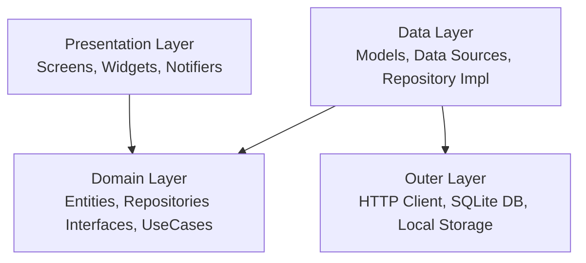

# Smart Task Manager

A feature-rich, offline-first Flutter task management application built following **Clean Architecture** principles, state management with **Riverpod**, and a minimal, responsive design system.

---

## 🚀 Features

- **Task Dashboard & Pagination**: Paginated infinite scrolling task list with pull-to-refresh.
- **Offline-First Architecture**: Cached SQLite database storage so tasks remain accessible even without an active internet connection.
- **Task Creation**: Create tasks with titles, descriptions, due dates, priority levels (`Low`, `Medium`, `High`), and categories (`Work`, `Personal`, etc.).
- **Task Details View**: Detailed overview showing status badge, metadata, dates, description, and bottom action bar.
- **Task Updating**: Update task completion status, title, description, priority, category, and due date via interactive modal bottom sheet from the details screen.
- **Task Deletion**: Delete tasks with confirmation dialogs, automatically updating both remote REST API and local SQLite cache.
- **Debounced Search**: Search tasks by title with client-side 300ms debouncing.
- **Filtering**: Filter tasks by completion status (*All*, *Pending*, *Completed*), category, and priority.
- **Sorting**: Multi-field sorting by *Due Date*, *Priority*, or *Created Date* in ascending or descending order.

---

## 📐 Architecture

This application strictly adheres to **Clean Architecture** with separation into three main layers:



### Layers Breakdown

1. **Domain Layer**:
   - **Entities**: Business models (`TaskEntity`).
   - **Repositories**: Abstract contracts (`TaskRepository`).
   - **Use Cases**: Encapsulated business logic (`GetTasksUseCase`, `DeleteTaskUseCase`, `UpdateTaskUseCase`).

2. **Data Layer**:
   - **Models**: DTOs for JSON & Database mapping (`TaskDataModel`, `TaskUpdateRequestModel`).
   - **Data Sources**: `TaskRemoteDataSource` (Dio REST API) and `TaskLocalDataSource` (SQLite Local DB).
   - **Repository Implementation**: `TaskRepositoryImpl` managing network fallback and caching logic.

3. **Presentation Layer**:
   - **Notifiers & States**: State management powered by `Riverpod` (`TaskListNotifier`, `TaskListState`).
   - **Views & Screens**: Responsive UI pages (`TaskListScreen`, `TaskDetailScreen`, `CreateTaskScreen`).
   - **Widgets**: Reusable components (`TaskCardItem`, `UpdateTaskBottomSheet`, `TaskSearchBar`, `TaskFilterChips`, `TaskSortSheet`).

4. **Outer & System Layer**:
   - **Database**: `SqliteDatabaseClient` managing SQLite table schema & queries.
   - **Network Info**: Internet connectivity checks for offline mode toggle.

---

## 📁 Directory & Folder Structure

```text
lib/
├── app.dart                        # Root MaterialApp configuration
├── bootstrap.dart                  # App initialization logic
├── main.dart                       # Entry point
└── src/
    ├── design_system/              # Reusable design tokens & UI components
    │   ├── colors/                 # App color palettes & tokens
    │   ├── extensions/             # BuildContext theme extensions
    │   ├── spacing/                # Spacing constants (xs, sm, md, lg, xl)
    │   └── widgets/                # Generic buttons, text fields, cards
    │
    ├── features/
    │   └── tasks/                  # Task feature module
    │       ├── data/
    │       │   ├── datasources/    # Remote (Dio) & Local (SQLite) Data Sources
    │       │   ├── models/         # API & DB Data Models (DTOs)
    │       │   └── repositories/   # TaskRepositoryImpl execution
    │       │
    │       ├── domain/
    │       │   ├── entities/       # Pure TaskEntity domain object
    │       │   ├── repositories/   # Abstract TaskRepository interface
    │       │   └── usecases/       # GetTasks, DeleteTask, UpdateTask use cases
    │       │
    │       └── presentation/
    │           ├── notifiers/      # Riverpod state notifiers & filters
    │           ├── view/           # TaskListScreen, TaskDetailScreen, CreateTaskScreen
    │           └── widgets/        # TaskCardItem, UpdateTaskBottomSheet, TaskSearchBar, etc.
    │
    ├── outer_layer/                # Infrastructure (Storage, SQLite Database)
    └── system/                     # Utilities, Navigation router, Helpers
```

---

## 🛠️ Getting Started & How to Run

### Prerequisites

- [Flutter SDK](https://docs.flutter.dev/get-started/install) (v3.22.0 or higher recommended)
- [Dart SDK](https://dart.dev/get-dart)
- An active Android Emulator, iOS Simulator, or connected physical device

### Installation & Setup Steps

1. **Clone the repository**:
   ```bash
   git clone <repository_url>
   cd smart_task_manager
   ```

2. **Install project dependencies**:
   ```bash
   flutter pub get
   ```

3. **Generate Code** *(if modifying freezed or Riverpod classes)*:
   ```bash
   dart run build_runner build --delete-conflicting-outputs
   ```

4. **Run Code Analysis & Lints**:
   ```bash
   flutter analyze
   ```

5. **Run the Application**:
   ```bash
   flutter run
   ```

---

## ⚙️ REST API Endpoints Integrated

- `GET /tasks/?user_id={user_id}&skip={skip}&limit={limit}` — Fetch paginated tasks list.
- `POST /tasks/?user_id={user_id}` — Create new task.
- `PUT /tasks/{task_id}?user_id={user_id}` — Update existing task fields.
- `DELETE /tasks/{task_id}?user_id={user_id}` — Delete task by ID.
